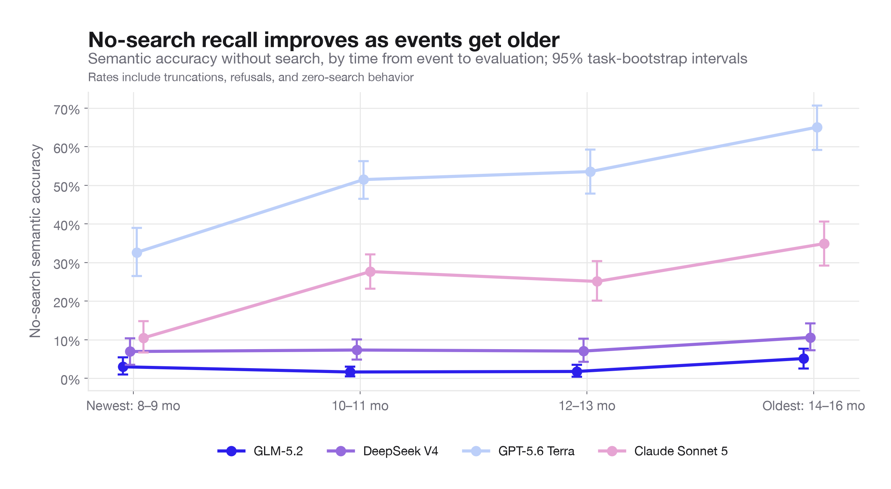
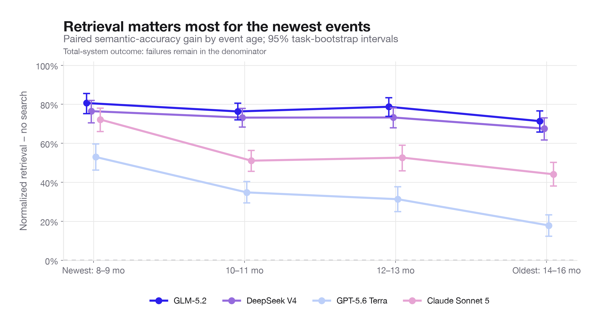
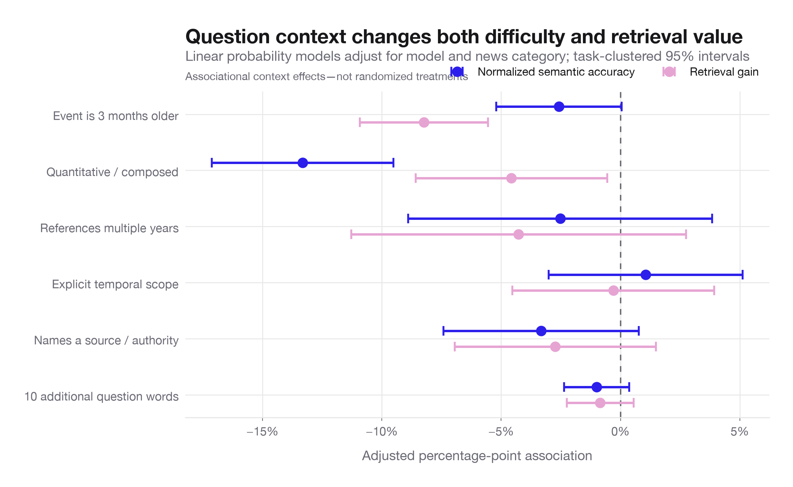
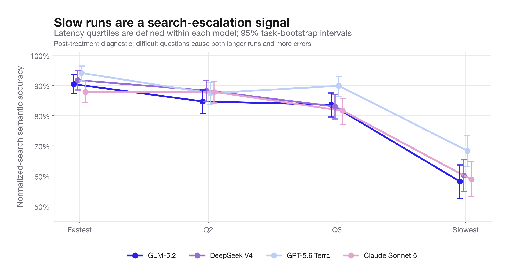

# How question timing and context change the answer

## The intuitive version

There are two different clocks in this evaluation:

1. **The event clock:** how long ago the underlying news event happened.
2. **The execution clock:** how long the model spends searching and answering.

They tell complementary stories.

- Newer events expose the limits of a model's internal knowledge. Retrieval is most valuable there.
- Slow executions are usually not productive extra deliberation. They signal that the search process is struggling.
- Once retrieval is available, the main remaining difficulty is not question length or explicit date wording. It is whether the answer requires combining, comparing, or calculating multiple facts.

The benchmark contains events from May–December 2025 and was run in August 2026. Thus “newest” means roughly 8–9 months old and “oldest” means 14–16 months old. This analysis concerns event recency, not time of day or a difference of a few hours.

## 1. Older events are easier to answer from memory

Without search, GPT's semantic accuracy rises from **33% on the newest events to 65% on the oldest**. Claude rises from **11% to 35%**. DeepSeek and GLM remain low across the whole range, reaching only 11% and 5% on the oldest group.



After adjusting for model, news category, question length, composition, multi-year references, temporal wording, and named sources, an event being three months older is associated with a **5.7 percentage-point increase in no-search semantic accuracy** (95% CI 3.8–7.6).

The model-specific adjusted slopes make the mechanism easier to see:

| Model | No-search change per 3 additional months of age | 95% CI |
|---|---:|---:|
| GPT-5.6 Terra | +11.6 pp | +7.9 to +15.4 |
| Claude Sonnet 5 | +8.5 pp | +5.2 to +11.8 |
| DeepSeek V4 | +1.8 pp | −0.6 to +4.1 |
| GLM-5.2 | +0.7 pp | −0.9 to +2.4 |

“Model memory” is shorthand here. The data cannot distinguish memorization, training-corpus inclusion, provider-side freshness, or general familiarity with older events. But operationally the result is clear: the frontier models can answer older benchmark events from internal knowledge much more often than newer ones, while the two open models remain retrieval-dependent throughout this time range.

## 2. Retrieval largely removes the recency disadvantage

Retrieval's semantic benefit is largest on the newest event group:

| Model | Retrieval gain, newest 8–9 months | Retrieval gain, oldest 14–16 months |
|---|---:|---:|
| GLM-5.2 | +80.6 pp | +71.4 pp |
| DeepSeek V4 | +76.5 pp | +67.5 pp |
| Claude Sonnet 5 | +72.2 pp | +44.1 pp |
| GPT-5.6 Terra | +53.0 pp | +17.9 pp |



Pooling models and adjusting for the other context variables, every additional three months of event age reduces retrieval's incremental value by **8.2 points** (95% CI −10.9 to −5.6).

The decline is strongest for GPT (**−13.6 points per three months**) and Claude (**−10.8**), because their no-search performance improves rapidly on older material. It is smaller for DeepSeek (**−5.3**) and uncertain for GLM (**−3.3, interval includes zero**).

This suggests a practical routing rule:

- For the newest questions, retrieval should be treated as mandatory for all four models.
- For older questions, skipping retrieval may be defensible for GPT when latency matters, although it still sacrifices accuracy.
- Event age is not a useful reason to skip retrieval for GLM or DeepSeek; their no-search accuracy remains low even on the oldest events in this benchmark.

## 3. Recency determines whether retrieval is needed; composition determines whether it is enough

After normalized retrieval is provided, event age has only a small, borderline association with accuracy: **−2.6 points per additional three months** (95% CI −5.2 to +0.1). In other words, retrieval mostly flattens the recency curve.

The large remaining penalty is for quantitative/composed questions. Holding the measured context constant, these questions are associated with:

- **13.3 points lower normalized semantic accuracy** (95% CI −17.1 to −9.5).
- **4.6 points less retrieval benefit** than simpler factual questions (−8.6 to −0.5).



That second result is especially informative. Composed questions are not merely missing evidence; even after retrieval finds relevant facts, the model still has to identify the correct operands, reconcile scopes or dates, and perform a comparison or calculation. Search attacks the knowledge bottleneck but not the reasoning bottleneck.

By contrast, these features do **not** have clear independent effects after adjustment:

- Referring to multiple years.
- Using explicit temporal language such as “as of,” “between,” “before,” or “during.”
- Naming an official source, report, authority, or database.
- Adding another ten words to the question.

This means “long and detailed” is not synonymous with “hard.” A long question that precisely identifies a single fact can be easier than a shorter question requiring two values to be extracted and combined.

## 4. Slow answers indicate search escalation

Within every model, the slowest quarter of normalized-search executions is dramatically less accurate than the fastest quarter:

| Model | Fastest-quarter accuracy | Slowest-quarter accuracy | Mean searches: fastest → slowest |
|---|---:|---:|---:|
| GPT-5.6 Terra | 94% | 68% | 1.0 → 3.5 |
| DeepSeek V4 | 92% | 60% | 2.1 → 3.7 |
| GLM-5.2 | 90% | 58% | 2.0 → 3.6 |
| Claude Sonnet 5 | 88% | 59% | 1.6 → 3.1 |



The fastest quartile takes roughly 3.6–7.7 seconds depending on model; the slowest takes 17–28 seconds. The accuracy drop occurs alongside a rise in search calls. Runs reaching five searches are particularly weak: semantic accuracy is approximately 19% for Claude, 29% DeepSeek, 30% GLM, and 49% GPT.

This is not evidence that waiting longer causes errors. Latency and search count are post-treatment variables: difficult questions cause both more searching and more errors. The useful interpretation is diagnostic. By the third or fourth unsuccessful search, the current strategy is often stuck.

A better escalation policy would change behavior rather than merely spend the remaining budget:

1. Reformulate the query around missing operands or date scope.
2. Switch to authoritative-domain search when the question names an official source.
3. Extract candidate facts into a structured table.
4. Invoke a calculation/verification stage for composed questions.
5. Return uncertainty when the retrieved values conflict instead of continuing near-duplicate searches.

## Product-level interpretation

The experiment suggests a two-dimensional router:

```text
                         SIMPLE FACT              COMPOSED / CALCULATED

NEWER EVENT              retrieval                retrieval + structured reasoning
                         strongly recommended     mandatory

OLDER EVENT              frontier model may       retrieval still useful;
                         sometimes answer from     structured reasoning remains key
                         memory; verify if risky
```

Then add a run-time escape hatch: if latency or search count crosses a model-specific threshold, treat that as evidence the initial retrieval plan has failed and switch strategies.

## Limits of interpretation

- Event age was not randomized. Although models adjust for category and measured question structure, unmeasured differences between early- and late-2025 stories may remain.
- All events are 8–16 months old at evaluation. The slope should not be extrapolated to breaking news measured in hours or to events many years old.
- Question-context flags are transparent heuristics, not human annotations.
- The semantic outcome comes from one judge. The timing direction is large and consistent, but absolute rates should still be audited.
- Latency and search count are diagnostics, not causal treatments.

## Reproducibility

The timing/context script generates the feature table, paired age effects, task-clustered regressions, model-specific slopes, search-escalation diagnostics, and charts. The core machine-readable outputs are `context_age_rates.csv`, `context_age_retrieval_gains.csv`, `context_adjusted_associations.csv`, `context_age_slopes_by_model.csv`, and `context_search_escalation.csv`.

---

## Attribution

Questions and reference answers come from LiveNewsBench, release
`jan_2026_release_2`, pinned at commit `8a6b96e`, MIT licensed. The benchmark is
the work of Yunfan Zhang, Kathleen McKeown, and Smaranda Muresan —
[arXiv:2602.13543](https://arxiv.org/abs/2602.13543). Cite it alongside any
result taken from this report; the BibTeX entry is in the
[repository README](../README.md#citation).

The rows carry the upstream canary asking that the benchmark never enter a
training corpus. These runs use five searches and zero page visits, which
differs from the benchmark's default allowance of five each.
