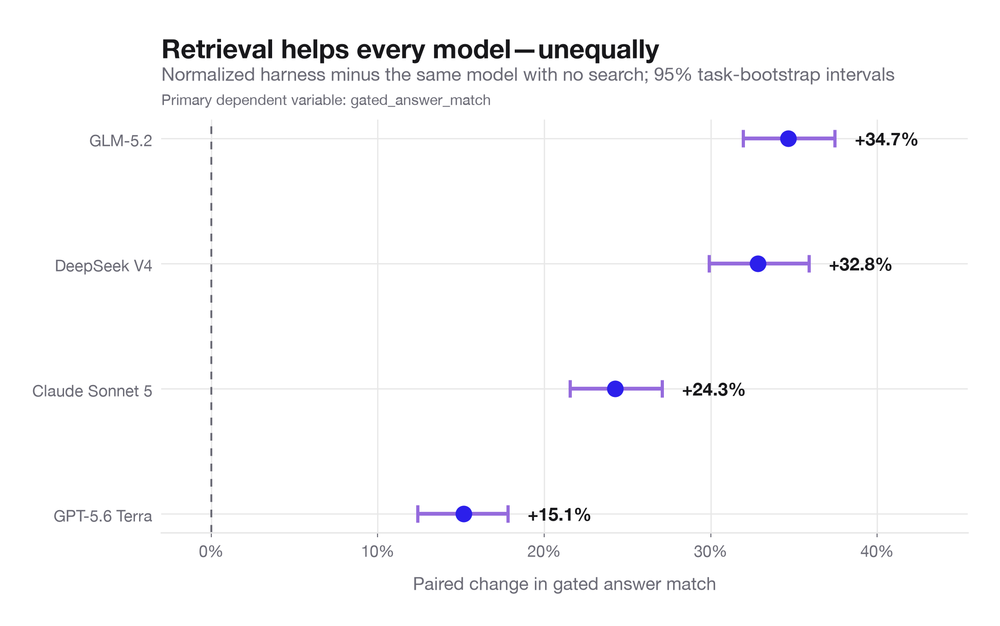
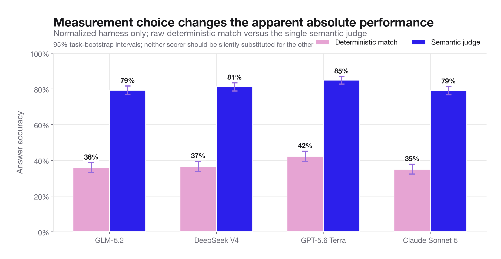
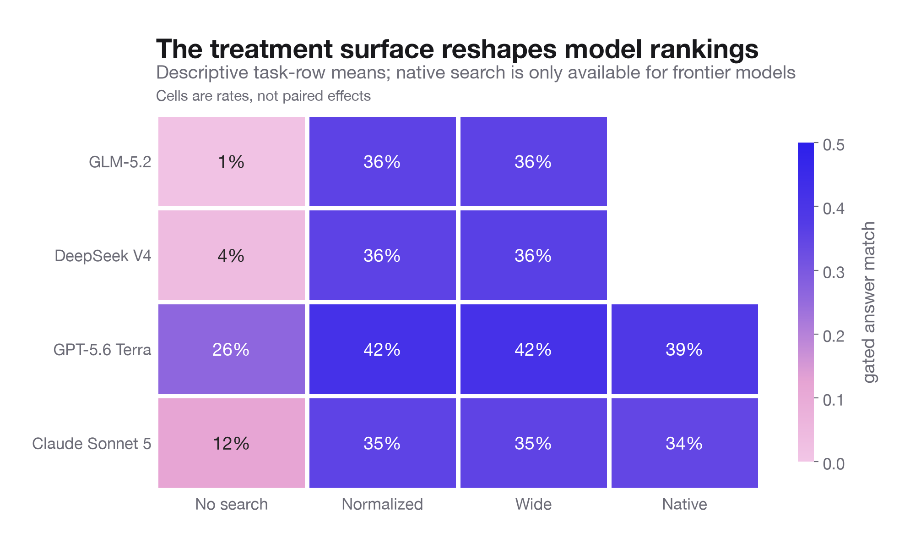
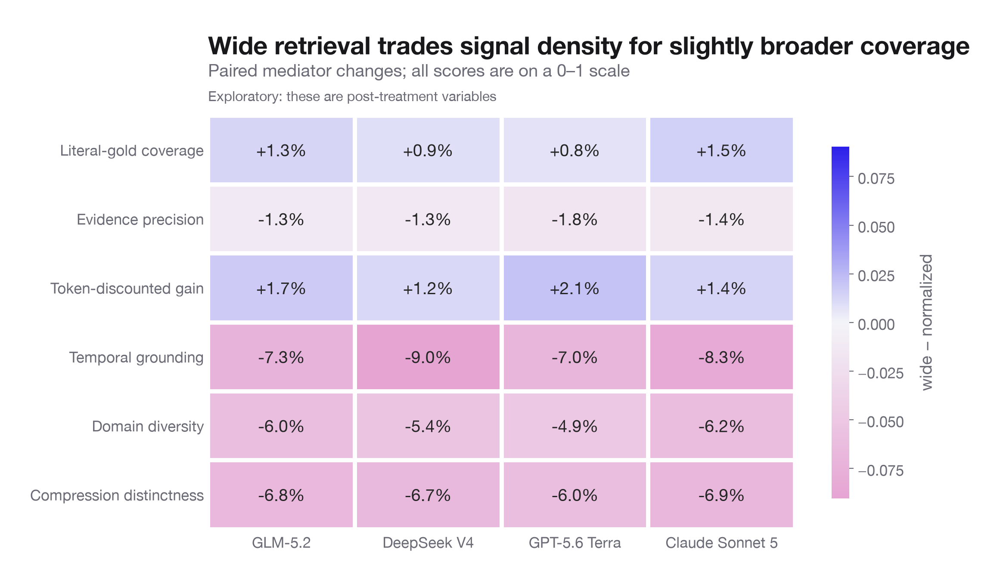
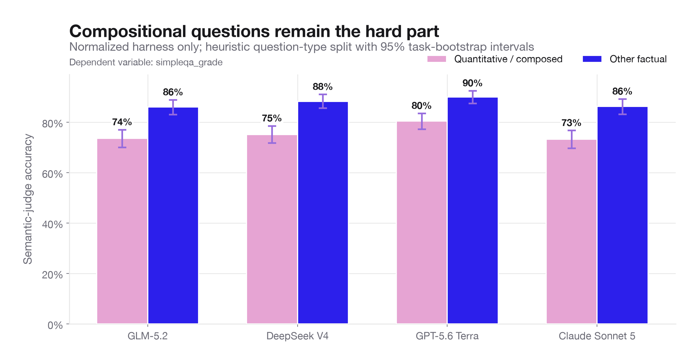

# Independent and dependent variable analysis

For an interpretable follow-up on event age, question structure, and run-time search escalation, see [How question timing and context change the answer](livenewsbench-full-sonnet-v2-context-timing-analysis.md).

## Executive read

The experiment supports a strong causal claim about retrieval: giving a model the normalized search harness substantially improves answer quality on the same tasks. The gain is not uniform. On the registered gated answer-match outcome, retrieval adds **34.7 points for GLM-5.2**, **32.8 for DeepSeek V4**, **24.3 for Claude Sonnet 5**, and **15.1 for GPT-5.6 Terra**. All four task-bootstrap intervals exclude zero.

The more interesting result is the interaction. Retrieval closes much of the no-search gap between open and frontier models. GLM's retrieval gain is **19.5 points larger than GPT's** (95% CI 16.3–22.7) and **9.7 points larger than Claude's** (7.2–12.4). DeepSeek's gain is **18.0 points larger than GPT's** (14.7–21.5) and **7.4 points larger than Claude's** (4.5–10.4). This means “which model is best?” is not a stable property: it depends materially on the retrieval system wrapped around it.

Three other conclusions matter:

1. **Wide retrieval is mostly a context-quality trade rather than an accuracy win.** It raises literal answer coverage by only 0.8–1.5 points, while lowering evidence precision by 1.3–1.8 points and the temporal-grounding, diversity, and distinctness scores by roughly 5–9 points. Strict answer match is unchanged for every model.
2. **The highlights feature is not experimentally identified.** Highlights were enabled in every harness arm, so there is no highlights-off counterfactual. Literal answer visibility is a mediator, not an independent variable. It is strongly associated with success, but that does not estimate the causal effect of highlighting.
3. **Outcome measurement is a first-order issue.** In normalized retrieval, deterministic answer match is 35–42%, while the semantic judge says 79–85%. The disagreement is strongly one-sided: 571–599 rows per model are deterministic-fail/judge-pass, but only 2–11 are deterministic-pass/judge-fail.



## Variable map

The cleanest causal picture is:

```text
task properties ───────────────┬──────────────> answer outcome
                              ├──> retrieval behavior
model assignment ─────────────┤
retrieval arm ────────────────┴──> retrieved evidence ──> answer outcome
                                     │
                                     ├─ literal-gold visibility
                                     ├─ evidence precision
                                     ├─ temporal grounding
                                     ├─ source diversity
                                     └─ redundancy / compression
```

### Independent variables that can support treatment comparisons

| Variable | Levels | What it estimates | Important limitation |
|---|---|---|---|
| Model identity | GLM-5.2, DeepSeek V4, GPT-5.6 Terra, Claude Sonnet 5 | Total effect of choosing that model in this stack | Model, vendor, defaults, style, and native tool behavior are bundled together |
| Retrieval availability | No search vs normalized harness | Value of the normalized retrieval system for each model | One generation per task-condition; uncertainty is across tasks, not repeated generations |
| Result-count tier | Normalized vs wide | Effect of returning the wider result payload | Search strategy can adapt, so this changes both payload and downstream search behavior |
| Search implementation | Native vs normalized harness | Total effect of native toolchain vs common harness | Defined only for GPT and Claude; it is not a full 4×4 factorial comparison |
| Model × retrieval | Difference in retrieval gain between models | Whether models depend differently on retrieval | Still bundles each model's prompting and tool-use behavior |

The task rows are paired across conditions. There are 1,329 dataset rows representing 1,129 unique task keys; inference therefore aggregates and resamples at the task-key level. The reported intervals are 5,000 task bootstraps. This protects against treating duplicated task keys as independent observations.

### Variables that are not treatments

- **Highlights enabled** is constant in the harness conditions. It cannot explain between-arm differences and its direct causal effect is unidentified.
- **Literal-gold visibility, precision, temporal grounding, domain entropy, distinctness, number of searches, latency, and answer length** occur after model/arm assignment. They are mediators or behavioral outcomes. Conditioning on them can introduce post-treatment bias.
- **Category and question type** are pre-treatment moderators. They are useful for asking where an effect is larger, but they were not assigned.
- **Refusal, truncation, zero-search behavior, and search degradation** are post-treatment failure modes. Excluding them changes the estimand from “total system effect” to “effect among eligible completions.”

## Dependent variables: what each one actually measures

### Primary registered outcome: `gated_answer_match`

This is a conservative, deterministic answer-match signal after dealbreaker gating. It is valuable when exactness matters, but it should not be read as general semantic correctness. Normalized-arm rates are 42% for GPT, 36% for DeepSeek, 36% for GLM, and 35% for Claude.

### Audit outcome: `simpleqa_grade`

The single semantic judge gives much higher normalized-arm rates: 85% GPT, 81% DeepSeek, and 79% for both GLM and Claude. Retrieval effects remain strongly positive on this outcome: **+76.6 GLM, +71.7 DeepSeek, +55.4 Claude, and +33.1 GPT points**. Thus the direction of the retrieval conclusion is robust, but the absolute performance level is not.



The disagreement is asymmetric:

| Model | Deterministic fail / judge pass | Deterministic pass / judge fail |
|---|---:|---:|
| GLM-5.2 | 590 | 11 |
| DeepSeek V4 | 599 | 4 |
| GPT-5.6 Terra | 572 | 2 |
| Claude Sonnet 5 | 571 | 4 |

This strongly suggests that the deterministic outcome is mainly a **precision-oriented lower bound**, not a noisy substitute for semantic correctness. If the product goal is “did the user get a correct answer?”, semantic audit should be co-primary or adjudicated. If the goal is “did the answer contain the canonical gold string?”, the deterministic outcome is appropriate.

### Operational dependent variables

The normalized harness averages 2.0–2.6 searches and 9.7–12.8 seconds per row. Model identity has an enormous effect on response length: normalized answers average about 7 words for GPT, 27 for Claude, 38 for DeepSeek, and 79 for GLM. This matters because verbosity can affect both string matching and judge acceptance.

Wide retrieval actually causes **fewer calls** than normalized retrieval (about 0.08–0.29 fewer, depending on model), presumably because each call returns a larger payload. It adds 1.9 seconds for GLM, but reduces latency by 0.8 seconds for GPT and 2.2 seconds for Claude; DeepSeek's difference is uncertain. Native search is 4.0 seconds slower than normalized for GPT and 1.4 seconds slower for Claude. Claude native answers are also about 59 words longer than normalized answers.

DeepSeek's no-search arm has 170 truncations (12.8%). Comparisons that exclude truncations describe eligible completions and can make no-search latency look artificially high or low. Raw system-level and eligible-answer analyses should therefore remain separate.

## Main treatment effects

### Normalized retrieval vs no search

| Model | Gated effect | 95% CI | Paired eligible tasks |
|---|---:|---:|---:|
| GLM-5.2 | +34.7 pp | +32.0 to +37.5 | 1,128 |
| DeepSeek V4 | +32.8 pp | +29.9 to +35.9 | 982 |
| Claude Sonnet 5 | +24.3 pp | +21.5 to +27.1 | 1,084 |
| GPT-5.6 Terra | +15.1 pp | +12.4 to +17.8 | 1,129 |

GPT starts much stronger without search (26% gated) than Claude (12%), DeepSeek (4%), or GLM (1%). With normalized retrieval, the range compresses to 35–42%. Retrieval is therefore partly a capability equalizer: the models with the weakest internal/current knowledge receive the largest marginal value from external evidence.



### Wide vs normalized

The strict gated effects are essentially zero: +0.3 GLM, +0.4 DeepSeek, −0.2 GPT, and +0.05 Claude points; every 95% interval crosses zero. The semantic judge is somewhat more favorable: +2.2 GLM, +2.2 DeepSeek, +1.0 GPT, and +3.3 Claude points. The GLM, DeepSeek, and Claude judge intervals exclude zero, but the lack of strict-match improvement and the mediator degradation argue against treating wide as a clear overall win.

The retrieval-quality changes are remarkably consistent across models:



The likely mechanism is **coverage–dilution tension**. Wide retrieves a little more answer-bearing text, but that text occupies a noisier, less focused context. The model may produce semantically acceptable elaborations more often without producing more canonical exact answers.

### Native vs normalized

GPT native search is **3.1 gated points worse** than normalized (95% CI −5.1 to −1.0) and **3.5 judge points worse** (−5.6 to −1.4). Claude native is 1.0 gated point and 0.6 judge point worse, with both intervals spanning zero. A shared normalized search interface is therefore clearly preferable for GPT in this run and statistically tied with Claude native on correctness, while being faster and much less verbose for Claude.

## Highlights and retrieval mediators

Only 11.5–12.1% of normalized eligible rows contain a detected literal gold alias in the scored surface text. When a literal answer is visible, gated accuracy rises from 29–36% to 76–86%, depending on model.


This does **not** mean highlights cause a 45–53 point gain. Easy questions may be more likely both to expose a literal alias and to be answered correctly; the metric may also share string-matching structure with the gated outcome. A less mechanically coupled check uses the semantic judge and controls for model, arm, and category with task-clustered uncertainty. On that analysis:

| Retrieval mediator | Adjusted association with judge success | 95% CI | Holm-adjusted p |
|---|---:|---:|---:|
| Literal-gold coverage | 2.09× odds, present vs absent | 1.38–3.17 | .0015 |
| Evidence precision | 1.67× odds per SD | 1.29–2.15 | .00031 |
| Domain diversity | 1.48× odds per SD | 1.35–1.63 | <.000001 |
| Token-discounted gain | 1.45× odds per SD | 1.24–1.69 | .000014 |
| Compression distinctness | 1.13× odds per SD | 1.02–1.25 | .047 |
| Temporal grounding | 0.95× odds per SD | 0.85–1.07 | .40 |

These are exploratory mediator associations, not controlled interventions. Still, they suggest the highlights/retrieval system is getting two things wrong:

- It seldom surfaces the canonical answer literally, even though literal visibility is highly useful.
- Returning more results does not preserve signal density or source distinctness. The system should optimize answer-bearing evidence per token, not raw result count.

The fact that semantic accuracy remains 78–84% even when no literal alias is detected means the literal detector is conservative: models can infer or paraphrase the answer, and some evidence is probably present in a non-canonical form. Thus “no detected literal gold” is not equivalent to “retrieval failed.”

## Where answers are still going wrong

The most consistent weakness is composition. Under normalized retrieval, semantic-judge accuracy on heuristic quantitative/composed questions is 73–80%, versus 86–90% on other factual questions—a gap of about 10–13 points for every model.



This points downstream of retrieval: many tasks require extracting multiple facts, reconciling dates or entities, and performing arithmetic. Better snippets alone will not solve all of those failures. A structured “extract values → show operation → verify units/date scope” answer stage is a promising intervention.

Category effects are exploratory but show another useful pattern. Retrieval gains are especially large in sports for GLM (+61 points), DeepSeek (+63), and Claude (+52), while business/economy and disasters are generally smaller for the open models. Some categories are small—science/technology has only 11–16 paired tasks—so these are experiment-design leads, not stable leaderboard claims.

There are also **98 task keys where all four normalized models receive judge-fail** before eligibility filtering (91 after filtering). That concentration is too high to assume every case is an independent model failure. The existing audit candidates include apparently stale or ambiguous numerical labels. These rows should be manually adjudicated because label error creates a ceiling that no retrieval change can fix.

## Threats to validity

- There is one generation per task-condition. The intervals capture task sampling variability, not model stochasticity or day-to-day search variation.
- Live search is temporally changing. Paired tasks reduce, but do not eliminate, time/order effects.
- Model comparisons bundle provider, prompting, decoding defaults, verbosity, and tool-use policy.
- Native search is missing for the two open models, so native-vs-harness is nested rather than fully factorial.
- Highlights has no off arm; causal claims about highlights are impossible from this matrix.
- One semantic judge can have systematic preference or leniency. The enormous scorer gap needs adjudication, not blind trust in either scorer.
- Post-treatment exclusions change the estimand. Total-system outcomes should count truncations/refusals; answer-quality outcomes may exclude them but must say so.
- Cost is not present in the root-span export, so there is no defensible quality-per-dollar dependent variable yet.

## Highest-value next experiments

1. **Run a true highlights ablation:** same retrieved documents and snippets, randomized highlights on/off. Add a third arm that changes highlight selection while holding formatting constant.
2. **Replace “wide” with precision-controlled retrieval:** fixed token budget, reranker threshold, deduplication, and diversity constraint. This directly tests the dilution hypothesis.
3. **Repeat each task-condition 3–5 times in interleaved blocks:** estimate generation variance and temporal search variance separately.
4. **Add a composition intervention:** force extraction of operands, dates, and units before the final answer; target the 10–13 point question-type gap.
5. **Adjudicate scorer disagreements and all-model failures:** create a stratified human sample of deterministic-fail/judge-pass, deterministic-pass/judge-fail, and all-model-fail cases.
6. **Capture cost/token spans:** make latency, tokens, and dollars co-primary operational outcomes so retrieval policies can be evaluated on a quality–cost frontier.

## Reproducibility

The analysis script builds the joined row-level table, task-paired bootstrap effects, difference-in-differences interactions, mediator regressions, CSV outputs, and all six figures. Generated tables are in the `analysis/variable_*.csv` files and the compact machine-readable summary is `analysis/variable_analysis_summary.json`.
