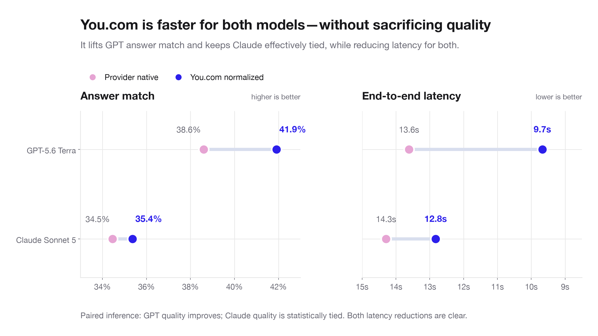
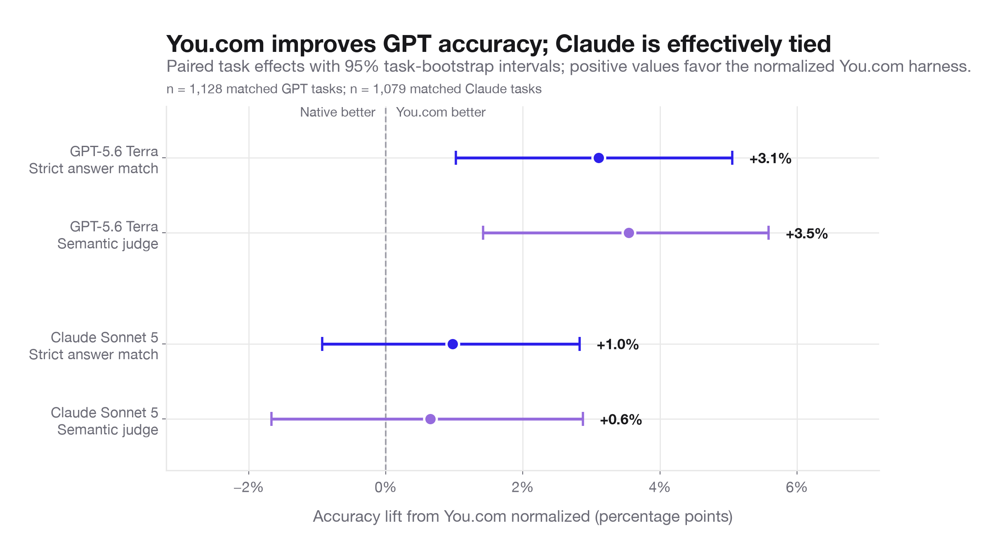
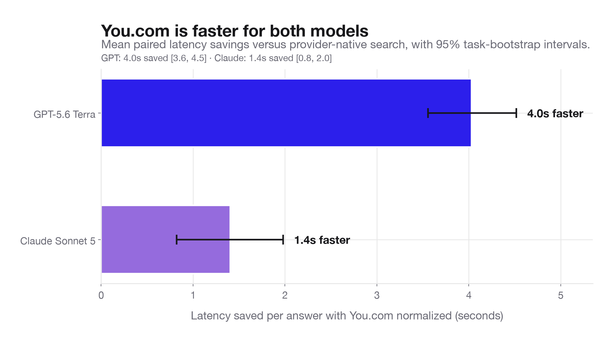
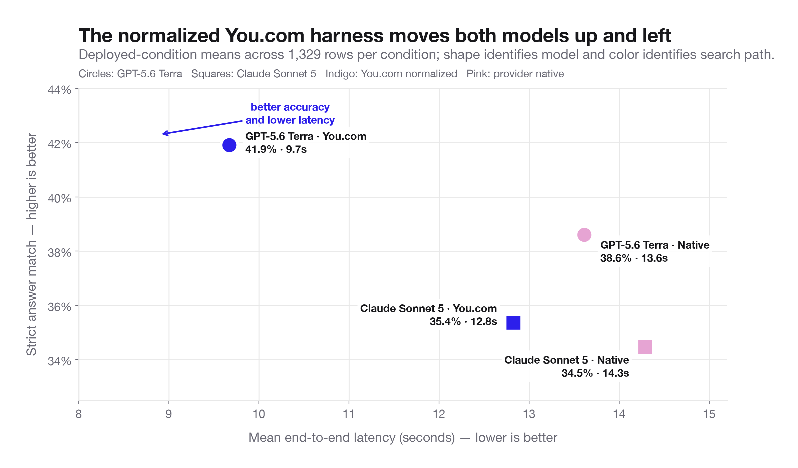

# You.com normalized vs provider-native search

These figures use the completed local analysis tables generated by
`analysis/analyze_variables.py`. They are intended to replace the provisional
Mermaid charts and early aggregate figures in the discussion.

## Recommended lead visual



**Suggested caption:** The normalized You.com harness is faster for both models.
It also improves GPT-5.6 Terra's answer match, while Claude Sonnet 5's quality is
statistically tied with provider-native search.

This is the recommended visual for the main discussion. It shows the complete
argument in one reading direction: native in pink, You.com in indigo, and
improvement moving left-to-right in both panels.

## Supporting detail

### Paired quality intervals



**Suggested caption:** On GPT-5.6 Terra, the normalized You.com harness improves
strict answer match by 3.1 percentage points and semantic-judge accuracy by 3.5
points versus provider-native search; both task-bootstrap intervals exclude
zero. Claude Sonnet 5 moves in the same direction, but neither accuracy interval
excludes zero.

### Paired latency intervals



**Suggested caption:** The normalized You.com harness is faster for both models:
4.0 seconds per answer for GPT-5.6 Terra and 1.4 seconds for Claude Sonnet 5.
Both 95% task-bootstrap intervals exclude zero.

### Quality-latency decision space



**Suggested caption:** Across 1,329 rows per condition, switching from
provider-native search to the normalized You.com harness moves both models
toward the preferred upper-left region: higher strict answer match and lower
mean latency.

## Editorial note

The current reproducible tables report slightly different deployed-condition
means from the early discussion (for example, GPT You.com latency is 9.7 seconds
in `variable_condition_summary.csv`). Use the values shown in these figures when
updating the prose. Cost is intentionally omitted because the root-span export
does not yet contain a defensible trace-aggregated cost field.

Recreate all outputs with:

```bash
.venv/bin/python analysis/plot_search_comparison.py
```
